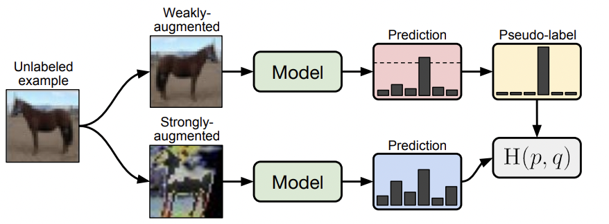
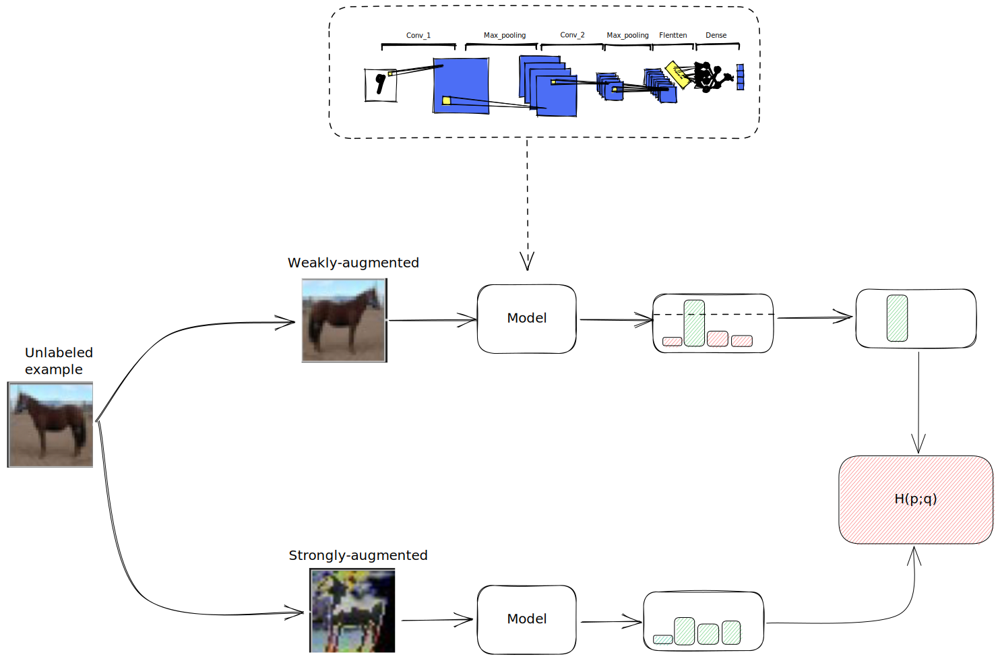

# Lecture Note on FixMatch

This is a lecture note on FixMatch for the 2ModIA project, a semi-supervised learning method that uses unlabeled data to improve the performance of supervised learning.

The paper is available at [arXiv](https://arxiv.org/abs/2001.07685).

- FixMatch first generates pseudo-labels using the model’s predictions on weakly-augmented unlabeled images.

- For a given image, the pseudo-label is only retained if the model produces a high-confidence prediction.

- The model is then trained to predict the pseudo-label when fed a strongly-augmented version of the same image.

## Base Idea

The paper proposes a simple effective semi-supervised learning (SSL) algorithm, called FixMatch, which combines two common SSL methods, **consistency regularization** and **pseudo-labeling**, to improve model performance using weakly-augmented unlabeled images and strongly-augmented labeled images.

Let $\mathcal{X}=\left\{\left(x_b, p_b\right): b \in(1, \ldots, B)\right\}$ be a batch of $B$ labeled examples, with $x_b$ a training examples and $p_b$ a one-hot labels.

Let $\mathcal{U}=\left\{\left(x_u, p_u\right): u \in(1, \ldots, \mu B)\right\}$ be a batch of $\mu B$ unlabeled examples (with $\mu$ a hyperparameter that determines the relative size of $\mathcal{X}$ and $\mathcal{U}$).

- First generate pseudo-labels using the model's prediction on weakly-audmented unlabeled data.
- Only keep high-confidence pseudo-labels.
- Then train the model with the pseudo-labels on the same image but this time with strong augmentation.
- The loss is the coss-entropy between weakly augmented prediction and the strongly augmented prediction.

<!--  -->

### Consistency regularization

> The model sould output the similar prediction for the same input, even if the input is slightly perturbed.

$$
\sum_{b=1}^{\mu B}\left\|
    \underbrace{p_{\mathrm{m}}\left(y \mid \alpha\left(u_b\right)\right)}_{\text { one weakly augmentation }}
    -
    \underbrace{p_{\mathrm{m}}\left(y \mid \alpha\left(u_b\right)\right)}_{\text { another weakly augmentation }}
    \right\|_2^2
$$

**Consistency regularization** is a technique used in machine learning to improve the robustness and generalization performance of models. It works by encouraging a model to produce consistent predictions when presented with slightly different versions of the same input. This can be see as a form of regularization, since it prevents the model from overfitting to the training data, under the hood a compacity constraint is added to the model.

Overall, consistency regularization can be a powerful technique for improving the robustness and generalization performance of machine learning models, especially in situations where labeled data is limited.

### Pseudo-labeling

> Using the model itself to obtain atificial labels (pseudo-labels) for unlabeled data.

$$
\frac{1}{\mu B} \sum_{b=1}^{\mu B}
\underbrace{\mathbb{1}\left(\max \left(q_b\right) \geq \tau\right)}_{\text { if the model is confident enough }} \underbrace{\mathrm{H}\left(\hat{q}_b, q_b\right)}_{\text { cross entropy between the prediction pseudo-label and the raw prediction }}
$$

with $q_b=p_{\mathrm{m}}\left(y \mid u_b\right)$ the predicted probability ($y$) for the image $u_b$, $\hat{q}_b=\arg \max \left(q_b\right)$ and $\tau$ is the threshold.

Pseudo-labeling is a semi-supervised learning technique where a model is trained on a small set of labeled data and then used to predict labels for the remaining unlabeled data. These predicted labels are called "pseudo-labels". The model is then re-trained using both the labeled and pseudo-labeled data. This process is repeated iteratively until convergence or a stopping criterion is reached.

The idea behind pseudo-labeling is that the model can learn from the predicted labels and improve its accuracy by incorporating the additional information from the unlabeled data.

## Loss

Supervised Loss $\ell_s$ (standard cross-entropy on weakly-augmented labeled data):
$$
\ell_s=\frac{1}{B} \sum_{b=1}^B \mathrm{H}\left(p_b, p_{\mathrm{m}}\left(y \mid \alpha\left(x_b\right)\right)\right)
$$

Unsupervised Loss $\ell_u$ (consistency regularization on weakly-augmented unlabeled data):

$$
\ell_u=\frac{1}{\mu B} \sum_{b=1}^{\mu B} \mathbb{1}\left(\max \left(q_b\right) \geq \tau\right) \mathrm{H}\left(\hat{q}_b, p_{\mathrm{m}}\left(y \mid \mathcal{A}\left(u_b\right)\right)\right)
$$

The final loss is a linear combination of the supervised and unsupervised losses:

$$
\ell_s+ \lambda_u \ell_u
$$

### Augmentation

FixMatch leverages two kinds of augmenation: `weak` ($\alpha(\cdot)$) and `strong` ($\mathcal{A}(\cdot)$).

The `weak` augmentation is:
- Random flip horizontally with a probability of 50%.
- Random translation image up to 12.5% vertically and horizontally.

The `strong` augmentation is:
- RandAugment (https://arxiv.org/abs/1805.09501)
- CTAugment ? (See if and how it's used)
- Followed by Cutout (https://arxiv.org/abs/1708.04552): Masking part of the image

AutoAugment is a already learned by reinforcement augmentation.

### Training parameters

Using SGD with momentum instead of Adam.
Nesterov momentum not really useful.

Cosine annealing for the scheduler.

## Results

FixMatch achieves state-of-the-art performance on several SSL benchmarks with a small number of labeled data points.
The performance of FixMatch is robust to different hyperparameter settings and architectural choices.
FixMatch can be easily implemented and scales well to large datasets.
FixMatch can be further improved by using stronger data augmentation techniques and increasing the model capacity.

We sould see a maximum accuracy of 94.33% on CIFAR-10 with 250 labeled data points.

And even 88.61% on CIFAR-100 with only 4 labels per class.

## Question ideas

- Can you explain how the proposed method compares to other state-of-the-art SSL algorithms in terms of sample efficiency and computational cost?

- How would the performance of FixMatch change if the dataset distribution is imbalanced or if the labeled data is noisy ?

- How can FixMatch be adapted to handle multi-modal or sequential data, such as text or video?

## Future research

- Investigating the application of FixMatch to transfer learning and domain adaptation problems.

- Studying the interpretability of FixMatch and its impact on model generalization.

- Exploring the combination of FixMatch with other SSL methods, such as mixup or virtual adversarial training.

- Extending FixMatch to handle different types of data, such as graph or tabular data.

- Evaluating the performance of FixMatch on large-scale datasets with millions of unlabeled examples.

## References

- Medium Article (Review — FixMatch: Simplifying Semi-Supervised Learning with Consistency and Confidence)[https://sh-tsang.medium.com/review-fixmatch-simplifying-semi-supervised-learning-with-consistency-and-confidence-907ef086a172]